# 管理員功能 11 細項規格書

## 說明
- 本文件僅針對管理員功能（監管、安全、仲裁、平台維護）之 11 個細項。
- 每個細項皆包含：流程圖（白底）、處理描述、資料詞彙。
- 欄位名稱依你提供之英文命名固定使用，不任意更改；僅在必要時補充新欄位。

---

## 1. 管理員登入

### 流程圖
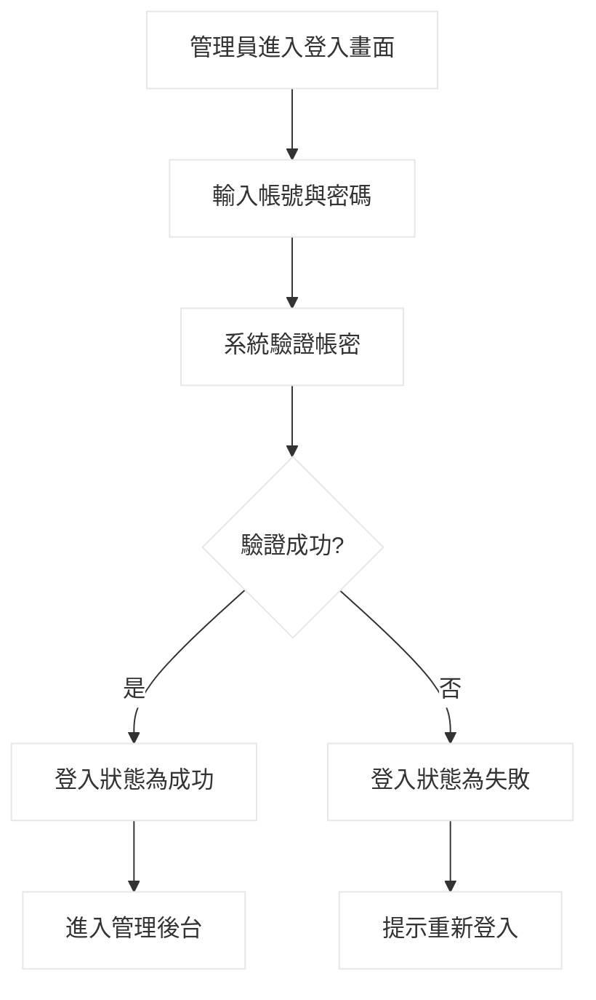

### 處理描述
**作業處理名稱**  
管理員登入  

**執行程序與規則**  
1. 管理員進入登入畫面。  
2. 輸入帳號（`account`）與密碼（`password`）並送出。  
3. 系統比對管理員帳號資料。  
4. 若正確，更新登入狀態並導向後台首頁。  
5. 若錯誤，回傳錯誤訊息並要求重新輸入。  

**資料輸入／來源**  
`account`、`password` / 管理員  

**資料輸出／目的地**  
登入驗證結果 / 後台首頁或登入頁  

**限制與備註**  
密碼需遮罩顯示；可搭配多因子驗證。

### 資料詞彙
| 欄位名稱 | 長度/型態 | 鍵 | 規則/格式/範圍/公式 | 範例 |
|---|---|---|---|---|
| account | VARCHAR(50) | UK | 管理員登入帳號 | admin01 |
| password | VARCHAR(255) |  | 儲存加密後密碼字串 | $2b$10$xxxx |
| login_status | VARCHAR(20) |  | `success`/`failed` | success |
| last_login_time | DATETIME |  | 最後登入時間 YYYY-MM-DD HH:MM:SS | 2026-04-27 09:10:00 |

---

## 2. 管理買家帳號

### 流程圖
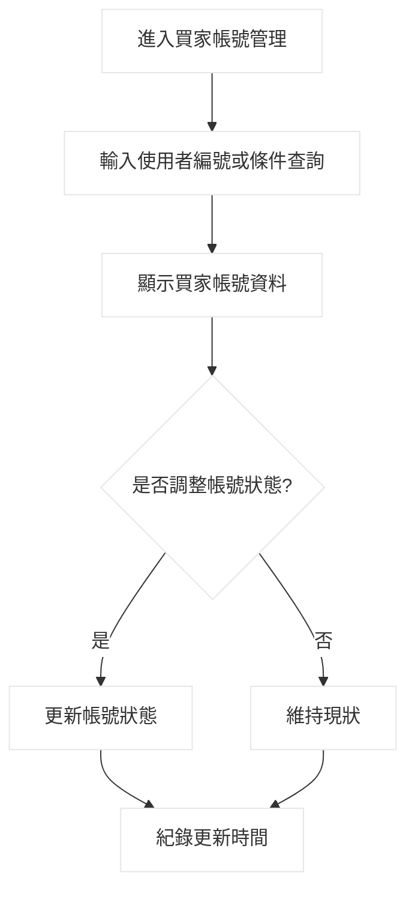

### 處理描述
**作業處理名稱**  
管理買家帳號  

**執行程序與規則**  
1. 管理員進入買家帳號管理頁。  
2. 透過 `user_id` 或狀態條件搜尋帳號。  
3. 系統顯示買家帳號基本資料與狀態。  
4. 管理員可調整帳號啟用/停用/限制。  
5. 系統寫入更新時間與操作紀錄。  

**資料輸入／來源**  
`user_id`、`account_status` / 管理員  

**資料輸出／目的地**  
帳號狀態異動結果 / 使用者主檔  

**限制與備註**  
僅限具會員管理權限之管理員操作。

### 資料詞彙
| 欄位名稱 | 長度/型態 | 鍵 | 規則/格式/範圍/公式 | 範例 |
|---|---|---|---|---|
| user_id | VARCHAR(20) | PK/FK | 買家使用者識別碼 | U000101 |
| account_status | VARCHAR(20) |  | `active`/`inactive`/`restricted` | active |
| updated_at | DATETIME |  | 帳號狀態更新時間 | 2026-04-27 09:30:00 |

---

## 3. 管理賣家帳號

### 流程圖
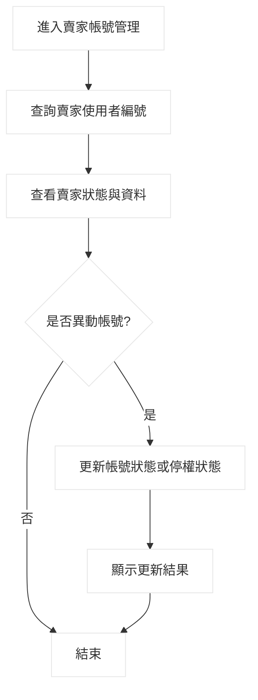

### 處理描述
**作業處理名稱**  
管理賣家帳號  

**執行程序與規則**  
1. 管理員進入賣家管理介面。  
2. 查詢賣家帳號後檢視其營運狀態。  
3. 若有違規或異常，調整帳號狀態。  
4. 系統更新資料並記錄操作歷程。  

**資料輸入／來源**  
`user_id`、`account_status`、`suspend_status` / 管理員  

**資料輸出／目的地**  
賣家帳號更新結果 / 使用者主檔、稽核紀錄  

**限制與備註**  
賣家停權需與停權管理流程一致。

### 資料詞彙
| 欄位名稱 | 長度/型態 | 鍵 | 規則/格式/範圍/公式 | 範例 |
|---|---|---|---|---|
| user_id | VARCHAR(20) | PK/FK | 賣家使用者識別碼 | U000888 |
| account_status | VARCHAR(20) |  | 帳號狀態 | restricted |
| suspend_status | VARCHAR(20) |  | `none`/`temporary`/`permanent` | none |
| updated_at | DATETIME |  | 異動時間 | 2026-04-27 09:45:00 |

---

## 4. 停權/封鎖

### 流程圖
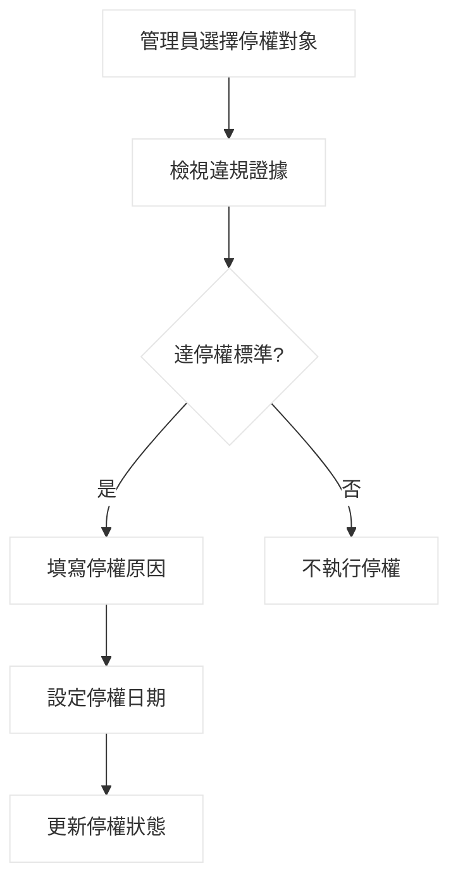

### 處理描述
**作業處理名稱**  
停權/封鎖  

**執行程序與規則**  
1. 管理員選擇欲停權帳號。  
2. 系統顯示違規紀錄與證據。  
3. 管理員判斷是否達停權標準。  
4. 若達標準，輸入停權原因與日期並送出。  
5. 系統更新停權狀態並通知使用者。  

**資料輸入／來源**  
`user_id`、`suspend_reason`、`suspend_date` / 管理員  

**資料輸出／目的地**  
停權結果 / 使用者主檔、通知模組  

**限制與備註**  
永久停權建議需二次審核。

### 資料詞彙
| 欄位名稱 | 長度/型態 | 鍵 | 規則/格式/範圍/公式 | 範例 |
|---|---|---|---|---|
| user_id | VARCHAR(20) | PK/FK | 被停權使用者識別碼 | U000345 |
| suspend_reason | VARCHAR(255) |  | 停權原因說明 | 惡意詐騙交易 |
| suspend_date | DATETIME |  | 停權生效時間 | 2026-04-27 10:00:00 |
| suspend_status | VARCHAR(20) |  | `temporary`/`permanent` | temporary |

---

## 5. 身份審核

### 流程圖
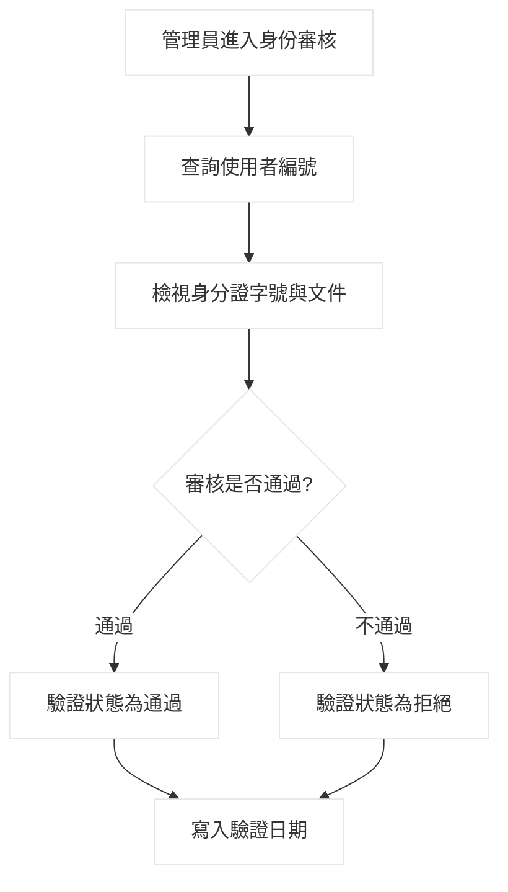

### 處理描述
**作業處理名稱**  
身份審核  

**執行程序與規則**  
1. 管理員開啟身份審核清單。  
2. 檢視申請者身份資料與文件。  
3. 依平台 KYC 規範判定通過與否。  
4. 系統更新審核狀態與日期。  

**資料輸入／來源**  
`user_id`、`identity_no`、審核決策 / 管理員  

**資料輸出／目的地**  
身份審核結果 / 使用者驗證資料  

**限制與備註**  
身份資料屬敏感資訊，需權限分級存取。

### 資料詞彙
| 欄位名稱 | 長度/型態 | 鍵 | 規則/格式/範圍/公式 | 範例 |
|---|---|---|---|---|
| user_id | VARCHAR(20) | PK/FK | 申請者識別碼 | U000567 |
| verification_status | VARCHAR(20) |  | `pending`/`approved`/`rejected` | approved |
| identity_no | VARCHAR(20) |  | 身分證字號/證件號碼 | A123456789 |
| verification_date | DATE |  | 審核日期 YYYY-MM-DD | 2026-04-27 |

---

## 6. 商品審核

### 流程圖
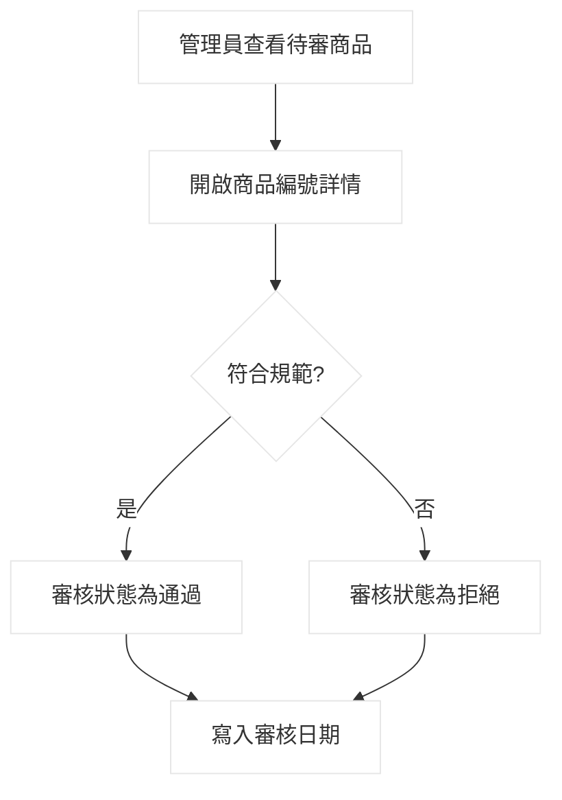

### 處理描述
**作業處理名稱**  
商品審核  

**執行程序與規則**  
1. 管理員進入商品審核頁面。  
2. 系統載入待審商品清單。  
3. 管理員檢視商品內容與規範符合性。  
4. 核准或駁回商品。  
5. 系統更新審核狀態與審核時間。  

**資料輸入／來源**  
`product_id`、審核判定 / 管理員  

**資料輸出／目的地**  
商品審核結果 / 商品審核資料  

**限制與備註**  
駁回時建議需填寫駁回原因。

### 資料詞彙
| 欄位名稱 | 長度/型態 | 鍵 | 規則/格式/範圍/公式 | 範例 |
|---|---|---|---|---|
| audit_id | VARCHAR(20) | PK | 審核紀錄編號 | AUD00123 |
| product_id | VARCHAR(20) | FK | 商品識別碼 | P000999 |
| audit_status | VARCHAR(20) |  | `pending`/`approved`/`rejected` | rejected |
| audit_date | DATETIME |  | 審核完成時間 | 2026-04-27 10:30:00 |

---

## 7. 違規商品下架

### 流程圖
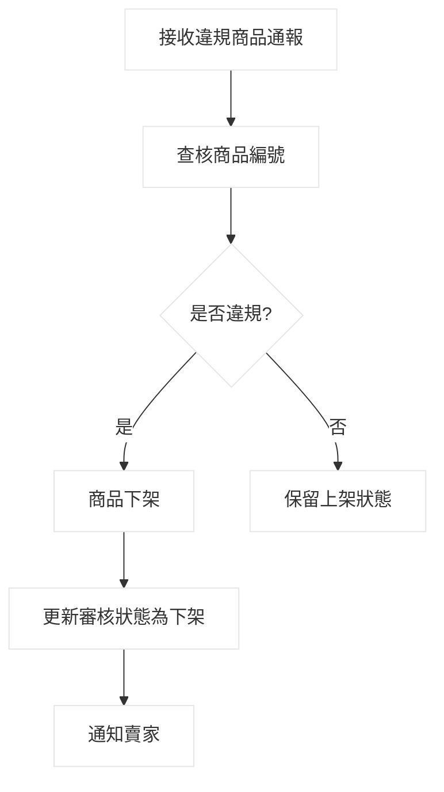

### 處理描述
**作業處理名稱**  
違規商品下架  

**執行程序與規則**  
1. 管理員接收檢舉或系統偵測的違規商品。  
2. 檢查商品內容是否違反規範。  
3. 若違規，立即下架並保留處理紀錄。  
4. 系統通知賣家並提供申訴管道。  

**資料輸入／來源**  
`product_id`、違規判定 / 管理員、檢舉系統  

**資料輸出／目的地**  
下架處置結果 / 商品主檔、通知系統  

**限制與備註**  
重大違規可同步觸發賣家停權流程。

### 資料詞彙
| 欄位名稱 | 長度/型態 | 鍵 | 規則/格式/範圍/公式 | 範例 |
|---|---|---|---|---|
| audit_id | VARCHAR(20) | PK | 下架審核紀錄編號 | AUD00901 |
| product_id | VARCHAR(20) | FK | 被下架商品編號 | P001122 |
| audit_status | VARCHAR(20) |  | `takedown`/`warning`/`pass` | takedown |
| audit_date | DATETIME |  | 下架處置時間 | 2026-04-27 10:45:00 |

---

## 8. 分類管理

### 流程圖
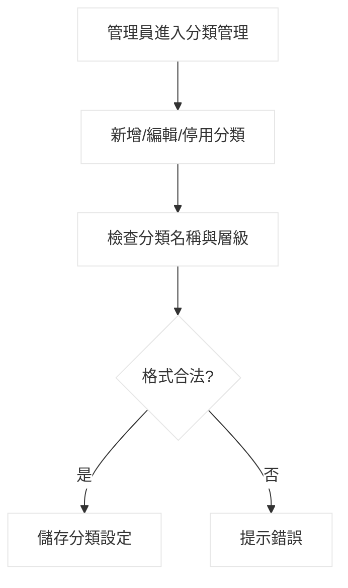

### 處理描述
**作業處理名稱**  
分類管理  

**執行程序與規則**  
1. 管理員開啟商品分類管理頁。  
2. 可新增、編輯、停用分類。  
3. 系統驗證分類名稱不可重複。  
4. 驗證成功後儲存分類設定並生效。  

**資料輸入／來源**  
`category_id`、`category_name`、`category_status` / 管理員  

**資料輸出／目的地**  
分類異動結果 / 商品分類資料  

**限制與備註**  
停用分類需確認是否仍有商品綁定。

### 資料詞彙
| 欄位名稱 | 長度/型態 | 鍵 | 規則/格式/範圍/公式 | 範例 |
|---|---|---|---|---|
| category_id | VARCHAR(20) | PK | 分類唯一識別碼 | CATE001 |
| category_name | VARCHAR(100) | UK | 分類名稱不可重複 | 3C 配件 |
| category_status | VARCHAR(20) |  | `active`/`inactive` | active |
| updated_at | DATETIME |  | 分類更新時間 | 2026-04-27 11:00:00 |

---

## 9. 異常價格偵測

### 流程圖
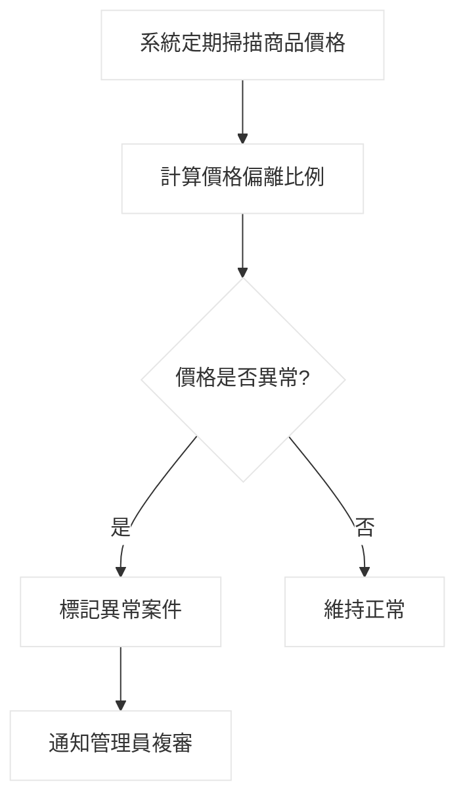

### 處理描述
**作業處理名稱**  
異常價格偵測  

**執行程序與規則**  
1. 系統定時比對商品價格與同類市場區間。  
2. 計算偏離程度，判斷是否超過門檻。  
3. 若超標，建立異常價格案件。  
4. 管理員進行人工複審與後續處置。  

**資料輸入／來源**  
`product_id`、`price`、市場比對資料 / 商品主檔、系統偵測  

**資料輸出／目的地**  
異常偵測結果 / 價格監管案件  

**限制與備註**  
偵測門檻需可配置，避免誤判正常促銷價格。

### 資料詞彙
| 欄位名稱 | 長度/型態 | 鍵 | 規則/格式/範圍/公式 | 範例 |
|---|---|---|---|---|
| price_monitor_id | VARCHAR(20) | PK | 價格監管案件編號 | PM00045 |
| product_id | VARCHAR(20) | FK | 商品識別碼 | P000321 |
| price | DECIMAL(10,2) |  | 商品現價（>=0） | 99999.00 |
| anomaly_flag | BOOLEAN |  | 是否異常（0/1） | 1 |
| detected_at | DATETIME |  | 偵測時間 | 2026-04-27 11:15:00 |

---

## 10. 惡意哄抬/詐騙價格處理

### 流程圖
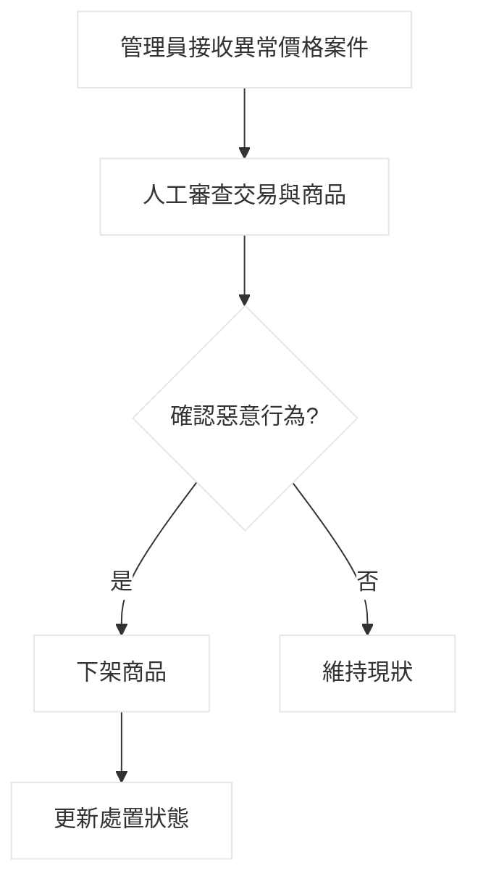

### 處理描述
**作業處理名稱**  
惡意哄抬/詐騙價格處理  

**執行程序與規則**  
1. 管理員接收異常價格案件。  
2. 檢查商品歷史價格、交易紀錄與檢舉內容。  
3. 若確認惡意哄抬或詐騙，執行下架、警告或停權。  
4. 系統記錄處置類型與時間，通知相關使用者。  

**資料輸入／來源**  
`price_monitor_id`、`user_id`、`product_id`、審查結果 / 管理員  

**資料輸出／目的地**  
處置結果 / 價格監管案件、使用者狀態  

**限制與備註**  
重大案件可移交糾紛仲裁或法務流程。

### 資料詞彙
| 欄位名稱 | 長度/型態 | 鍵 | 規則/格式/範圍/公式 | 範例 |
|---|---|---|---|---|
| price_monitor_id | VARCHAR(20) | PK/FK | 來源監管案件編號 | PM00045 |
| user_id | VARCHAR(20) | FK | 涉案賣家編號 | U000888 |
| product_id | VARCHAR(20) | FK | 涉案商品編號 | P000321 |
| action_status | VARCHAR(20) |  | `warning`/`takedown`/`suspend` | suspend |
| resolved_date | DATETIME |  | 案件處置完成時間 | 2026-04-27 11:25:00 |

---

## 11. 平台手續費設定

### 流程圖
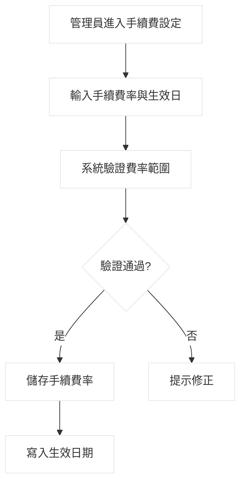

### 處理描述
**作業處理名稱**  
平台手續費設定  

**執行程序與規則**  
1. 管理員進入平台手續費設定頁。  
2. 輸入手續費率與生效日期。  
3. 系統檢查費率是否在允許範圍。  
4. 驗證成功後儲存新設定並於生效日套用。  
5. 系統保留版本與異動紀錄。  

**資料輸入／來源**  
`fee_rate`、`effective_date` / 管理員  

**資料輸出／目的地**  
手續費設定結果 / 平台計費設定  

**限制與備註**  
費率調整需公告；不得追溯既有已完成訂單。

### 資料詞彙
| 欄位名稱 | 長度/型態 | 鍵 | 規則/格式/範圍/公式 | 範例 |
|---|---|---|---|---|
| fee_config_id | VARCHAR(20) | PK | 手續費設定識別碼 | FEE202604 |
| fee_rate | DECIMAL(5,2) |  | 平台手續費率（0.00~100.00） | 5.00 |
| effective_date | DATE |  | 生效日期 YYYY-MM-DD | 2026-05-01 |
| updated_at | DATETIME |  | 設定更新時間 | 2026-04-27 11:35:00 |

---

## 補充：你提到的詞彙新增範例（可用）

以下格式正確、且不影響既有命名：

| 欄位名稱 | 長度/型態 | 鍵 | 規則/格式/範圍/公式 | 範例 |
|---|---|---|---|---|
| report_date | DATE |  | 報表產生日期，格式 YYYY-MM-DD | 2025-04-01 |

