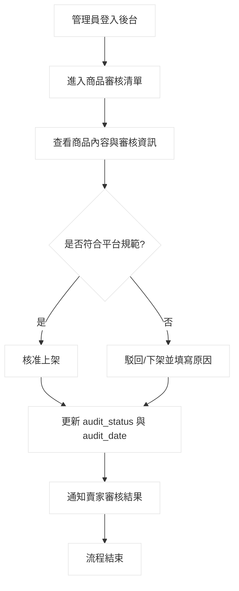
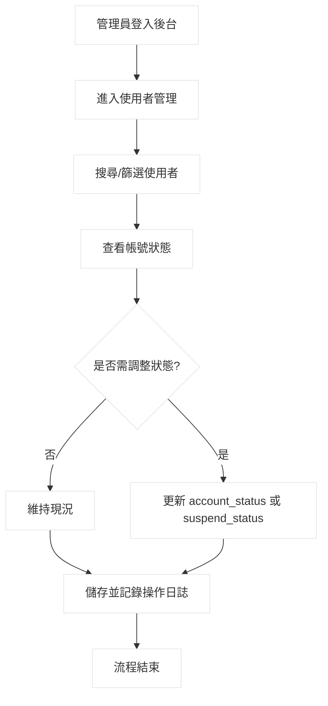
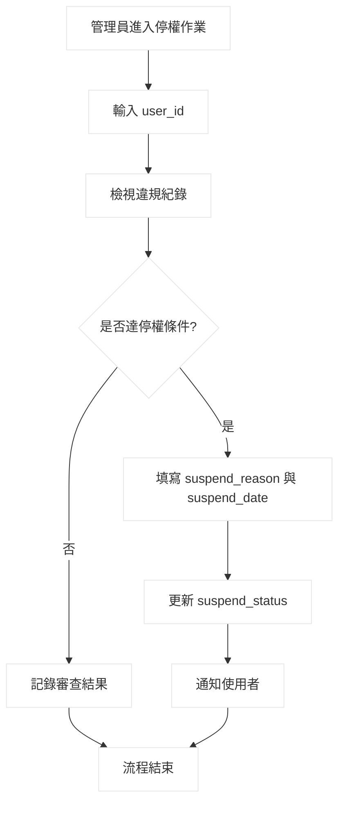
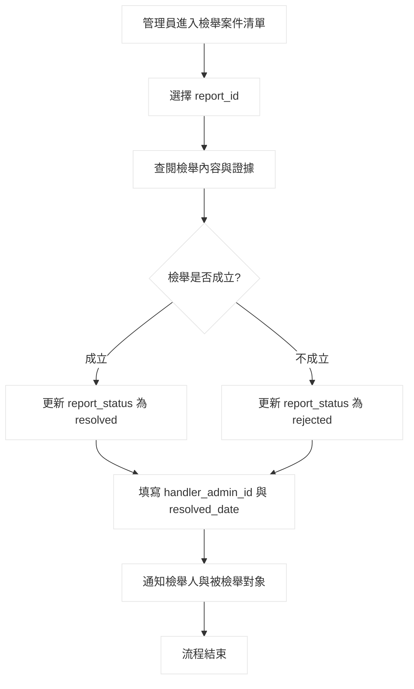
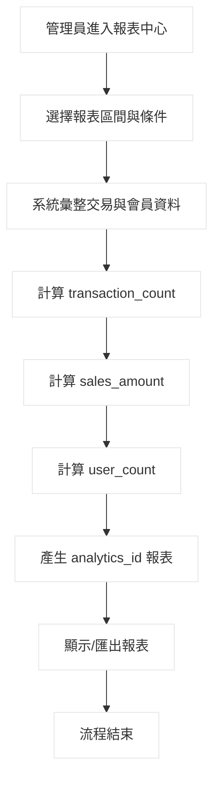
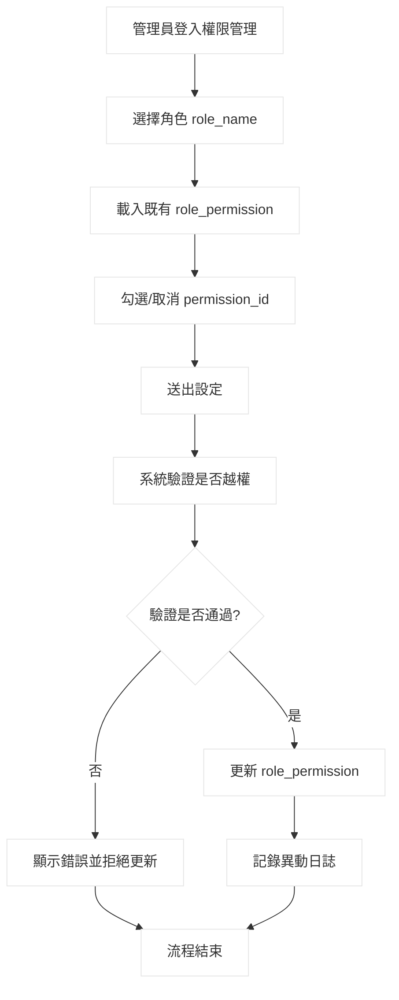

# 後台管理子功能＆角色權限規格書（六大功能）

## 一、功能總覽（管理員）

本文件對應六個後台功能：
1. 商品審核  
2. 使用者管理  
3. 停權管理  
4. 檢舉處理  
5. 統計報表  
6. 角色權限設定  

---

## 1) 商品審核

### 流程圖

### 處理描述

**作業處理名稱**  
商品審核

**執行程序與規則**  
1. 管理員進入後台商品審核畫面。  
2. 系統載入待審核商品清單。  
3. 管理員檢視商品名稱、描述、價格、分類與圖片。  
4. 系統比對平台商品規範（禁售品、違規詞、異常資訊）。  
5. 若符合規範，管理員執行核准；若不符合，執行駁回或下架。  
6. 系統寫入審核結果與時間，並通知賣家。  

**資料輸入／來源**  
`product_id`、商品內容資料、審核判斷 / 管理員

**資料輸出／目的地**  
審核結果（核准/駁回） / 商品資料、賣家通知

**限制與備註**  
審核結果須保留紀錄；駁回時需填寫原因以利後續申訴或復審。

### 藍圖

- **角色**：管理員  
- **前置條件**：管理員已登入且具商品審核權限  
- **主要流程**：讀取待審清單 → 審核內容 → 核准或駁回 → 通知賣家  
- **例外流程**：商品資料不完整時標記補件  
- **後置結果**：商品狀態更新為可上架或不通過

### 資料詞彙

| 欄位名稱 | 長度/型態 | 鍵 | 規則/格式/範圍/公式 | 範例 |
|---|---|---|---|---|
| audit_id | VARCHAR(20) | PK | 商品審核紀錄唯一識別碼 | AUD0001 |
| product_id | VARCHAR(20) | FK | 對應商品主檔 | P10001 |
| audit_status | VARCHAR(20) |  | `pending`/`approved`/`rejected` | approved |
| audit_date | DATETIME |  | 審核完成時間（YYYY-MM-DD HH:MM:SS） | 2026-04-27 10:30:00 |

---

## 2) 使用者管理

### 流程圖

### 處理描述

**作業處理名稱**  
使用者管理

**執行程序與規則**  
1. 管理員進入使用者管理畫面。  
2. 系統提供帳號查詢、篩選與狀態檢視。  
3. 管理員依據違規紀錄、交易異常或申訴結果判斷是否調整帳號狀態。  
4. 若需調整，更新帳號狀態（啟用、停用、限制）。  
5. 系統保存操作紀錄與異動時間。  

**資料輸入／來源**  
`user_id`、`account_status`、`suspend_status` / 管理員

**資料輸出／目的地**  
更新後使用者狀態 / 使用者主檔、後台管理紀錄

**限制與備註**  
高風險操作應有權限控管與操作日誌追蹤。

### 藍圖

- **角色**：管理員  
- **前置條件**：具會員管理權限  
- **主要流程**：查詢使用者 → 判斷狀態 → 更新狀態 → 留存日誌  
- **例外流程**：查無帳號或帳號已刪除  
- **後置結果**：使用者帳號狀態更新完成

### 資料詞彙

| 欄位名稱 | 長度/型態 | 鍵 | 規則/格式/範圍/公式 | 範例 |
|---|---|---|---|---|
| user_id | VARCHAR(20) | PK/FK | 使用者唯一識別碼 | U000345 |
| account_status | VARCHAR(20) |  | `active`/`inactive`/`restricted` | active |
| suspend_status | VARCHAR(20) |  | `none`/`temporary`/`permanent` | temporary |

---

## 3) 停權管理

### 流程圖

### 處理描述

**作業處理名稱**  
停權管理

**執行程序與規則**  
1. 管理員於後台停權作業輸入欲處理之使用者。  
2. 系統顯示該使用者違規、檢舉與交易異常紀錄。  
3. 管理員依平台停權規則判斷是否停權。  
4. 若達停權條件，管理員填寫停權原因與停權日期。  
5. 系統更新停權狀態並通知使用者。  

**資料輸入／來源**  
`user_id`、`suspend_reason`、`suspend_date` / 管理員

**資料輸出／目的地**  
停權結果 / 使用者帳號狀態、通知系統

**限制與備註**  
停權原因需可稽核；永久停權應需更高層級審核。

### 藍圖

- **角色**：管理員、被處理使用者  
- **前置條件**：管理員具停權權限  
- **主要流程**：查違規紀錄 → 判斷條件 → 執行停權 → 通知使用者  
- **例外流程**：證據不足時僅警告不停權  
- **後置結果**：使用者狀態改為暫停或永久停權

### 資料詞彙

| 欄位名稱 | 長度/型態 | 鍵 | 規則/格式/範圍/公式 | 範例 |
|---|---|---|---|---|
| user_id | VARCHAR(20) | PK/FK | 被停權使用者識別碼 | U000345 |
| suspend_reason | VARCHAR(255) |  | 停權原因文字敘述 | 多次詐騙交易 |
| suspend_date | DATETIME |  | 停權生效時間（YYYY-MM-DD HH:MM:SS） | 2026-04-27 11:10:00 |

---

## 4) 檢舉處理

### 流程圖

### 處理描述

**作業處理名稱**  
檢舉處理

**執行程序與規則**  
1. 管理員進入檢舉處理頁面，查看待處理案件。  
2. 開啟檢舉內容，確認檢舉原因與相關證據。  
3. 管理員判定檢舉是否成立。  
4. 成立則採取處置並更新案件狀態；不成立則結案。  
5. 系統記錄處理管理員與處理完成時間。  
6. 系統通知相關使用者處理結果。  

**資料輸入／來源**  
`report_id`、`report_status`、`handler_admin_id` / 管理員

**資料輸出／目的地**  
案件處理結果 / 檢舉資料、通知模組

**限制與備註**  
處理過程需保留可追蹤紀錄；必要時移轉糾紛仲裁流程。

### 藍圖

- **角色**：管理員、檢舉人、被檢舉對象  
- **前置條件**：存在待處理檢舉案件  
- **主要流程**：查看案件 → 判定成立與否 → 更新狀態 → 通知雙方  
- **例外流程**：證據不足時要求補件  
- **後置結果**：檢舉案件狀態完成更新並結案

### 資料詞彙

| 欄位名稱 | 長度/型態 | 鍵 | 規則/格式/範圍/公式 | 範例 |
|---|---|---|---|---|
| report_id | VARCHAR(20) | PK/FK | 檢舉案件唯一識別碼 | RPT00088 |
| report_status | VARCHAR(20) |  | `pending`/`resolved`/`rejected` | resolved |
| handler_admin_id | VARCHAR(20) | FK | 處理案件之管理員編號 | A00012 |
| resolved_date | DATETIME |  | 結案時間（YYYY-MM-DD HH:MM:SS） | 2026-04-27 11:20:00 |

---

## 5) 統計報表

### 流程圖

### 處理描述

**作業處理名稱**  
統計報表

**執行程序與規則**  
1. 管理員進入統計報表頁面。  
2. 設定統計期間、篩選條件（例如交易類型、會員範圍）。  
3. 系統自訂單、付款與會員資料表彙整資料。  
4. 系統計算交易數、銷售金額與使用者數。  
5. 產生報表並提供查閱或匯出。  

**資料輸入／來源**  
報表期間、篩選條件 / 管理員

**資料輸出／目的地**  
統計結果 / 後台報表頁面、匯出檔案

**限制與備註**  
報表時間區間不可倒置；需註明資料更新時間點。

### 藍圖

- **角色**：管理員  
- **前置條件**：具報表讀取權限  
- **主要流程**：設定條件 → 彙整資料 → 計算指標 → 呈現報表  
- **例外流程**：區間無資料時顯示 0 值報表  
- **後置結果**：生成可查詢與可匯出之統計報表

### 資料詞彙

| 欄位名稱 | 長度/型態 | 鍵 | 規則/格式/範圍/公式 | 範例 |
|---|---|---|---|---|
| analytics_id | VARCHAR(20) | PK | 統計報表唯一識別碼 | ANL20260427 |
| transaction_count | INT |  | 區間內完成交易筆數（>=0） | 1250 |
| sales_amount | DECIMAL(12,2) |  | 區間內成交總金額（>=0） | 386520.00 |
| user_count | INT |  | 區間內活躍使用者數（>=0） | 842 |

---

## 6) 角色權限設定

### 流程圖

### 處理描述

**作業處理名稱**  
角色權限設定

**執行程序與規則**  
1. 管理員進入角色權限設定頁面。  
2. 選擇欲調整之角色（buyer/seller/admin）。  
3. 系統顯示該角色目前可用功能權限。  
4. 管理員調整權限項目後送出。  
5. 系統檢查是否符合權限規則與避免越權。  
6. 驗證通過則更新設定並寫入異動紀錄。  

**資料輸入／來源**  
`role_id`、`permission_id`、`role_permission`、`role_name` / 管理員

**資料輸出／目的地**  
更新後角色權限 / 權限設定資料、操作日誌

**限制與備註**  
管理員角色之核心權限不可全部移除；異動需保留歷程。

### 藍圖

- **角色**：超級管理員、一般管理員  
- **前置條件**：登入且具角色權限管理資格  
- **主要流程**：選角色 → 調整權限 → 驗證 → 寫入設定  
- **例外流程**：越權設定時拒絕儲存  
- **後置結果**：角色權限生效並可追蹤異動

### 資料詞彙

| 欄位名稱 | 長度/型態 | 鍵 | 規則/格式/範圍/公式 | 範例 |
|---|---|---|---|---|
| role_id | VARCHAR(20) | PK | 角色唯一識別碼 | ROLE_ADMIN |
| permission_id | VARCHAR(20) | PK/FK | 權限項目識別碼 | PERM_AUDIT_PRODUCT |
| role_permission | BOOLEAN |  | 是否擁有該權限（0/1） | 1 |
| role_name | VARCHAR(20) |  | 角色名稱：`buyer`/`seller`/`admin` | admin |

---

## 附註（命名一致性）

本文件欄位名稱已依你提供之資料詞彙命名，避免命名混亂。若你後續要做資料表（ERD）或 API 規格，我可以再直接幫你延伸成：
- 資料表 SQL（MySQL / PostgreSQL）
- RESTful API 規格（含 request/response）
- 權限矩陣（各角色可操作功能）
