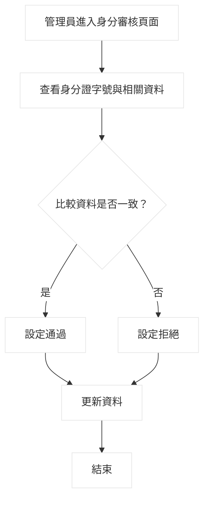
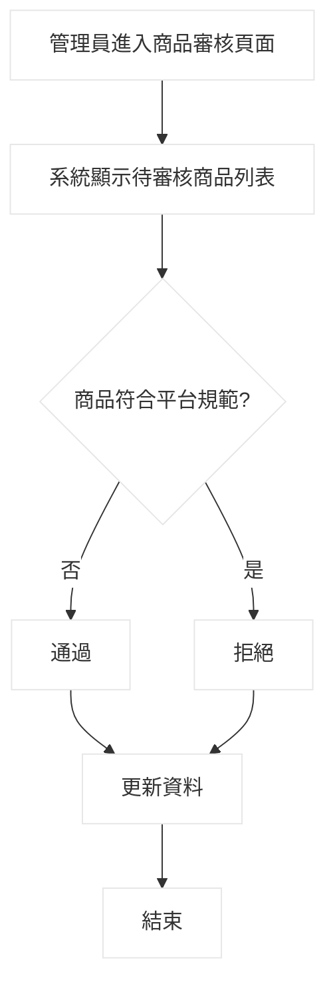
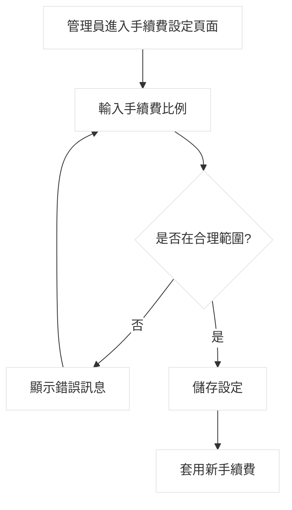
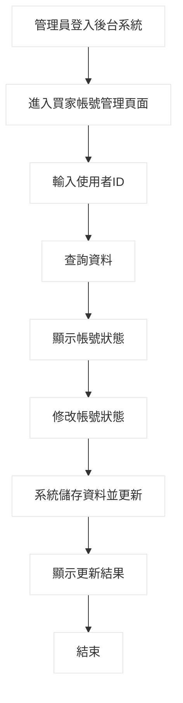
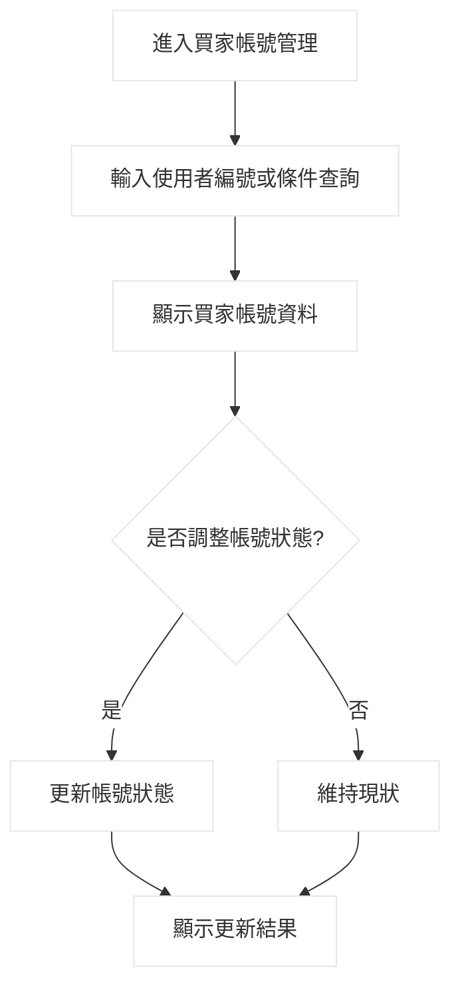
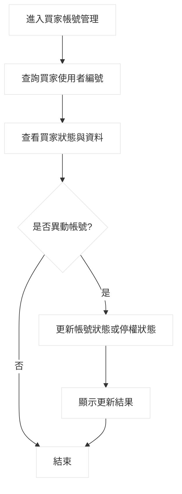

---

## 2️ 身分審核

```mermaid
%%{init: {"theme":"base","themeVariables":{"primaryColor":"#ffffff","secondaryColor":"#ffffff","tertiaryColor":"#ffffff","mainBkg":"#ffffff","lineColor":"#333333","textColor":"#111111"}}}%%
flowchart TD
A[管理員進入身分審核頁面]
A -->B[查看身分證字號與相關資料]
B --> C{比較資料是否一致？}
C -- 是 --> D[設定通過]
C -- 否 --> E[設定拒絕]
D --> F[更新資料]
E --> F
F --> G[結束]


```
## 8️⃣ 商品審核

```mermaid
%%{init: {"theme":"base","themeVariables":{"primaryColor":"#ffffff","secondaryColor":"#ffffff","tertiaryColor":"#ffffff","mainBkg":"#ffffff","lineColor":"#333333","textColor":"#111111"}}}%%
flowchart TD
A[管理員進入商品審核頁面]
A --> B[系統顯示待審核商品列表]
B --> C{商品符合平台規範?}
C -- 否 --> D[通過]
C -- 是 --> E[拒絕]
D --> F[更新資料]
E --> F
F --> G[結束]

```
##平台手續費設定

```mermaid
%%{init: {"theme":"base","themeVariables":{"primaryColor":"#ffffff","secondaryColor":"#ffffff","tertiaryColor":"#ffffff","mainBkg":"#ffffff","lineColor":"#333333","textColor":"#111111"}}}%%
flowchart TD
 B[管理員進入手續費設定頁面]
B --> C[輸入手續費比例]
C --> D{是否在合理範圍?}
D -- 否 --> E[顯示錯誤訊息]
E --> C
D -- 是 --> F[儲存設定]
F --> G[套用新手續費]
```
## 8️⃣ 管理買家帳號

```mermaid
%%{init: {"theme":"base","themeVariables":{"primaryColor":"#ffffff","secondaryColor":"#ffffff","tertiaryColor":"#ffffff","mainBkg":"#ffffff","lineColor":"#333333","textColor":"#111111"}}}%%
flowchart TD
A[管理員登入後台系統]
A --> B[進入買家帳號管理頁面]
B --> C[輸入使用者ID]
C --> D[查詢資料]
D --> E[顯示帳號狀態]
E --> F[修改帳號狀態]
F --> G[系統儲存資料並更新]
G --> H[顯示更新結果]
H --> I[結束]

```

## 2. 管理買家帳號

### 流程圖

```mermaid
%%{init: {"theme":"base","themeVariables":{"primaryColor":"#ffffff","secondaryColor":"#ffffff","tertiaryColor":"#ffffff","mainBkg":"#ffffff","lineColor":"#333333","textColor":"#111111"}}}%%
flowchart TD
    A[進入買家帳號管理] --> B[輸入使用者編號或條件查詢]
    B --> C[顯示買家帳號資料]
    C --> D{是否調整帳號狀態?}
    D -- 是 --> E[更新帳號狀態]
    D -- 否 --> F[維持現狀]
    E --> G[顯示更新結果]
    F --> G
```

## 3. 管理賣家帳號

### 流程圖

```mermaid
%%{init: {"theme":"base","themeVariables":{"primaryColor":"#ffffff","secondaryColor":"#ffffff","tertiaryColor":"#ffffff","mainBkg":"#ffffff","lineColor":"#333333","textColor":"#111111"}}}%%
flowchart TD
    A[進入買家帳號管理] --> B[查詢買家使用者編號]
    B --> C[查看買家狀態與資料]
    C --> D{是否異動帳號?}
    D -- 是 --> E[更新帳號狀態或停權狀態]
    D -- 否 --> F[結束]
    E --> G[顯示更新結果]
    G --> F
```
