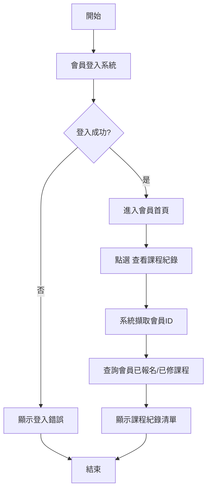
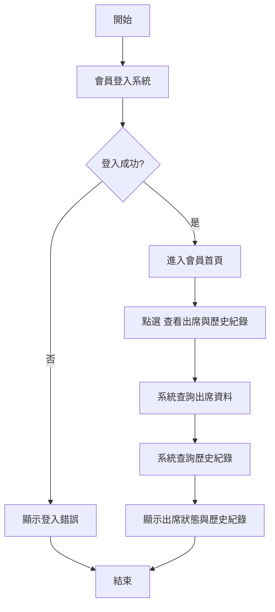
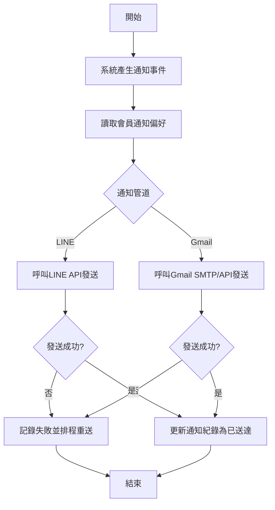
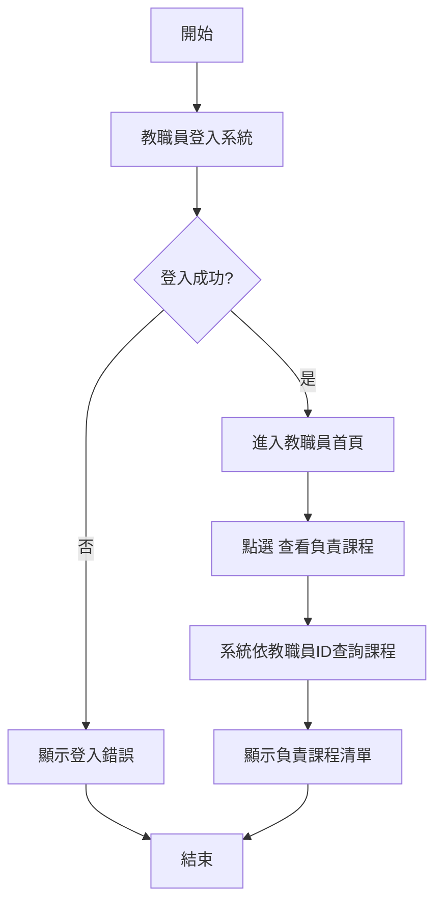
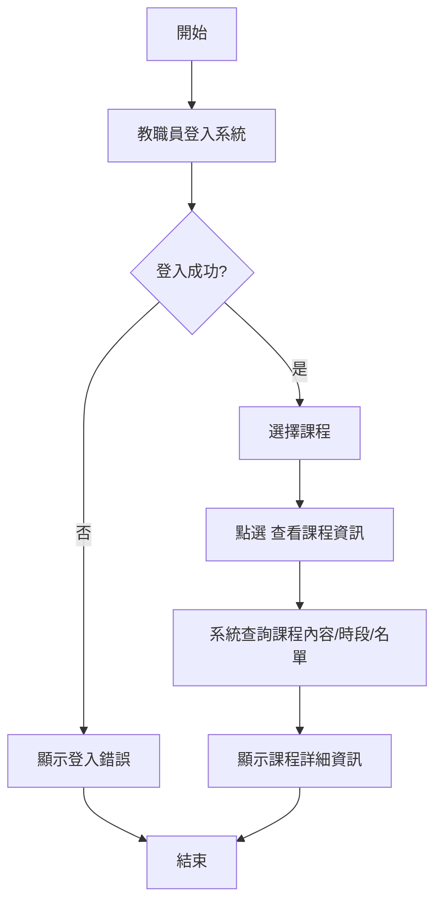
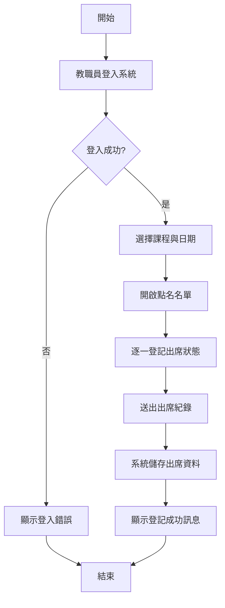
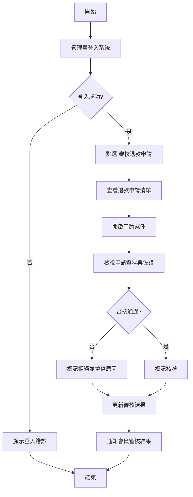
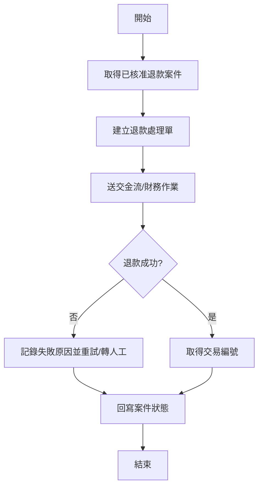

# 15 個功能流程圖

以下為依角色拆分的 15 個功能流程圖（Mermaid）。

---

## 1) 會員－查看課程紀錄


## 2) 會員－查看出席與歷史紀錄


## 3) 會員－接收通知（LINE / Gmail）


## 4) 會員－提出退款申請
```mermaid
flowchart TD
    A[開始] --> B[會員登入系統]
    B --> C{登入成功?}
    C -- 否 --> D[顯示登入錯誤] --> Z[結束]
    C -- 是 --> E[點選 提出退款申請]
    E --> F[選擇課程與退款原因]
    F --> G[上傳佐證資料(選填)]
    G --> H[送出申請]
    H --> I[系統驗證資料完整性]
    I --> J{驗證通過?}
    J -- 否 --> K[提示補件/修正資料] --> Z
    J -- 是 --> L[建立退款申請單]
    L --> M[狀態設為 審核中]
    M --> N[通知管理員待審核]
    N --> Z[結束]
```

## 5) 會員－查看退款狀態
```mermaid
flowchart TD
    A[開始] --> B[會員登入系統]
    B --> C{登入成功?}
    C -- 否 --> D[顯示登入錯誤] --> Z[結束]
    C -- 是 --> E[點選 查看退款狀態]
    E --> F[系統查詢退款申請紀錄]
    F --> G[顯示狀態(審核中/核准/拒絕/已退款)]
    G --> H{有更新?}
    H -- 是 --> I[顯示最新處理時間與結果說明]
    H -- 否 --> Z[結束]
    I --> Z
```

---

## 6) 教職員－查看負責課程


## 7) 教職員－查看課程資訊


## 8) 教職員－登記出席狀態


## 9) 教職員－更新課程紀錄
```mermaid
flowchart TD
    A[開始] --> B[教職員登入系統]
    B --> C{登入成功?}
    C -- 否 --> D[顯示登入錯誤] --> Z[結束]
    C -- 是 --> E[選擇欲更新課程]
    E --> F[編輯課程紀錄(內容/備註/附件)]
    F --> G[送出更新]
    G --> H[系統驗證權限與格式]
    H --> I{驗證通過?}
    I -- 否 --> J[顯示錯誤並要求修正] --> Z
    I -- 是 --> K[寫入課程紀錄]
    K --> L[保留異動歷程]
    L --> Z[結束]
```

---

## 10) 管理員－查看課程紀錄


## 11) 管理員－查看出席紀錄
```mermaid
flowchart TD
    A[開始] --> B[管理員登入系統]
    B --> C{登入成功?}
    C -- 否 --> D[顯示登入錯誤] --> Z[結束]
    C -- 是 --> E[點選 查看出席紀錄]
    E --> F[設定篩選條件(課程/日期/會員)]
    F --> G[系統查詢出席資料]
    G --> H[顯示出席統計與明細]
    H --> Z[結束]
```

## 12) 管理員－管理通知系統
```mermaid
flowchart TD
    A[開始] --> B[管理員登入系統]
    B --> C{登入成功?}
    C -- 否 --> D[顯示登入錯誤] --> Z[結束]
    C -- 是 --> E[點選 管理通知系統]
    E --> F[建立/編輯通知內容]
    F --> G[選擇通知對象與管道(LINE/Gmail)]
    G --> H[發送或排程通知]
    H --> I[系統寫入通知紀錄]
    I --> J[顯示發送結果]
    J --> Z[結束]
```

## 13) 管理員－審核退款申請


## 14) 管理員－處理退款流程


## 15) 管理員－更新退款結果
```mermaid
flowchart TD
    A[開始] --> B[管理員登入系統]
    B --> C{登入成功?}
    C -- 否 --> D[顯示登入錯誤] --> Z[結束]
    C -- 是 --> E[開啟退款案件]
    E --> F[填寫退款結果(成功/失敗/部分退款)]
    F --> G[輸入備註與交易資訊]
    G --> H[更新案件狀態]
    H --> I[系統保存異動紀錄]
    I --> J[通知會員最終退款結果]
    J --> Z[結束]
```
