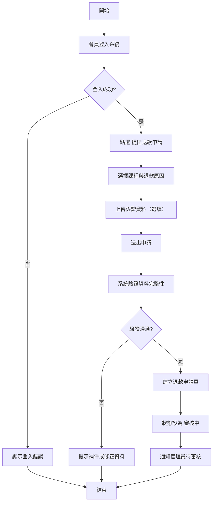
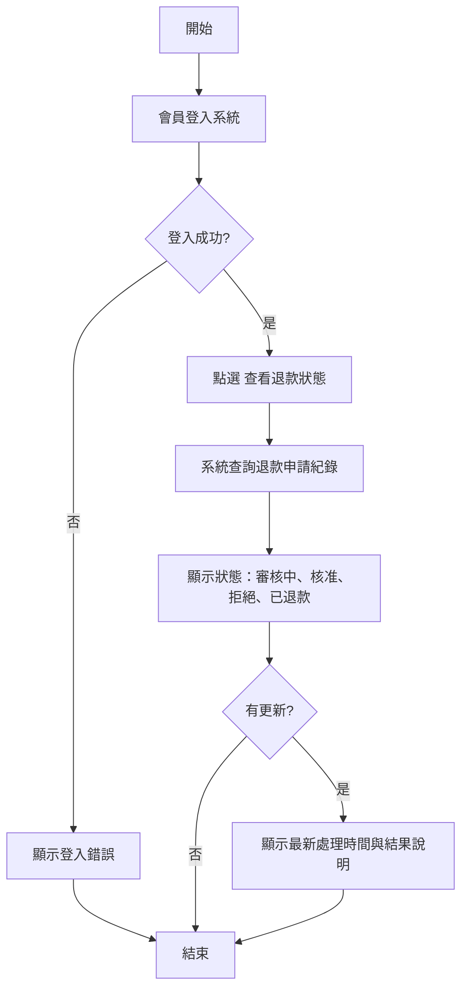
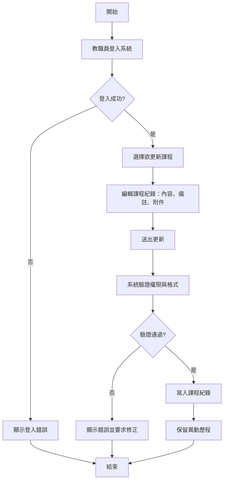
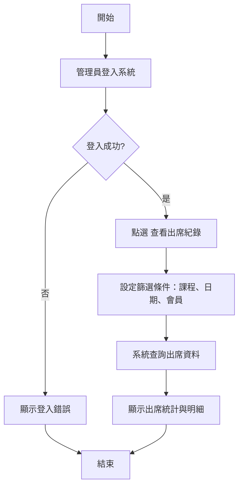
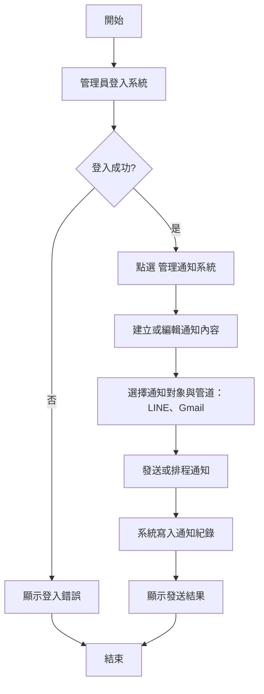
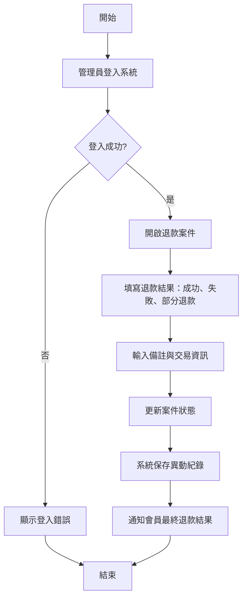

# 6 個修正版流程圖（Mermaid）

以下為你先前無法渲染的 6 張流程圖，已改成較穩定的 Mermaid 寫法（節點文字使用雙引號）。

---

## 4) 會員－提出退款申請

```mermaid
flowchart TD
    A["開始"] --> B["會員登入系統"]
    B --> C{"登入成功?"}
    C -- 否 --> D["顯示登入錯誤"] --> Z["結束"]
    C -- 是 --> E["點選 提出退款申請"]
    E --> F["選擇課程與退款原因"]
    F --> G["上傳佐證資料（選填）"]
    G --> H["送出申請"]
    H --> I["系統驗證資料完整性"]
    I --> J{"驗證通過?"}
    J -- 否 --> K["提示補件或修正資料"] --> Z
    J -- 是 --> L["建立退款申請單"]
    L --> M["狀態設為 審核中"]
    M --> N["通知管理員待審核"]
    N --> Z
```

## 5) 會員－查看退款狀態

```mermaid
flowchart TD
    A["開始"] --> B["會員登入系統"]
    B --> C{"登入成功?"}
    C -- 否 --> D["顯示登入錯誤"] --> Z["結束"]
    C -- 是 --> E["點選 查看退款狀態"]
    E --> F["系統查詢退款申請紀錄"]
    F --> G["顯示狀態：審核中、核准、拒絕、已退款"]
    G --> H{"有更新?"}
    H -- 是 --> I["顯示最新處理時間與結果說明"]
    H -- 否 --> Z
    I --> Z
```

## 9) 教職員－更新課程紀錄

```mermaid
flowchart TD
    A["開始"] --> B["教職員登入系統"]
    B --> C{"登入成功?"}
    C -- 否 --> D["顯示登入錯誤"] --> Z["結束"]
    C -- 是 --> E["選擇欲更新課程"]
    E --> F["編輯課程紀錄：內容、備註、附件"]
    F --> G["送出更新"]
    G --> H["系統驗證權限與格式"]
    H --> I{"驗證通過?"}
    I -- 否 --> J["顯示錯誤並要求修正"] --> Z
    I -- 是 --> K["寫入課程紀錄"]
    K --> L["保留異動歷程"]
    L --> Z
```

## 11) 管理員－查看出席紀錄

```mermaid
flowchart TD
    A["開始"] --> B["管理員登入系統"]
    B --> C{"登入成功?"}
    C -- 否 --> D["顯示登入錯誤"] --> Z["結束"]
    C -- 是 --> E["點選 查看出席紀錄"]
    E --> F["設定篩選條件：課程、日期、會員"]
    F --> G["系統查詢出席資料"]
    G --> H["顯示出席統計與明細"]
    H --> Z
```

## 12) 管理員－管理通知系統

```mermaid
flowchart TD
    A["開始"] --> B["管理員登入系統"]
    B --> C{"登入成功?"}
    C -- 否 --> D["顯示登入錯誤"] --> Z["結束"]
    C -- 是 --> E["點選 管理通知系統"]
    E --> F["建立或編輯通知內容"]
    F --> G["選擇通知對象與管道：LINE、Gmail"]
    G --> H["發送或排程通知"]
    H --> I["系統寫入通知紀錄"]
    I --> J["顯示發送結果"]
    J --> Z
```

## 15) 管理員－更新退款結果

```mermaid
flowchart TD
    A["開始"] --> B["管理員登入系統"]
    B --> C{"登入成功?"}
    C -- 否 --> D["顯示登入錯誤"] --> Z["結束"]
    C -- 是 --> E["開啟退款案件"]
    E --> F["填寫退款結果：成功、失敗、部分退款"]
    F --> G["輸入備註與交易資訊"]
    G --> H["更新案件狀態"]
    H --> I["系統保存異動紀錄"]
    I --> J["通知會員最終退款結果"]
    J --> Z
```
