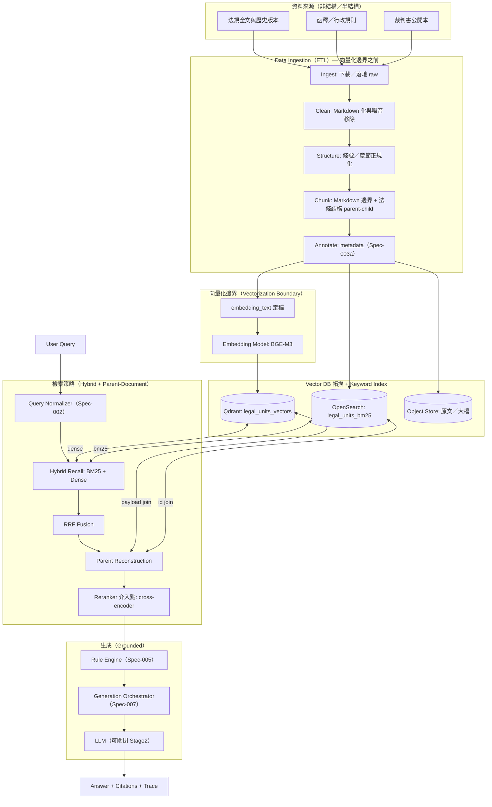

# 架構圖解：法條檢索與案例輔助（法規 + 判決摘要）RAG

- Status: Draft
- Owner: RAG Architect
- Last Updated: 2026-04-18

## 1. 圖示（Mermaid）

> 原始檔：`architecture.mmd`（可貼到支援 Mermaid 的渲染器或 VS Code 外掛預覽）

## 2. 架構敘述（對照作業要求）

### 2.1 Data Ingestion（ETL）

ETL 的輸入是「原始法源與裁判文本」，輸出是 **可索引、可版本治理** 的 `legal_units`（見 [Spec-003](../specs/spec-003-knowledge-etl.md) 與 [Spec-004](../specs/spec-004-legal-unit-schema.md)）。

六階段管線：

1. Ingest
2. Clean
3. Structure（條號／版本）
4. Chunk（**Markdown 標記 + 法條結構**）
5. Annotate（LLM/規則）
6. Validate（自動 + 抽樣人工）

### 2.2 Embedding Model 選擇

* **主模型**：BGE-M3（多語、長文本、可自建服務）
* **對照組**：OpenAI `text-embedding-3-large`（用於 offline A/B）

決策理由見 [ADR-001](../adr/ADR-001-embedding-model.md)。

### 2.3 Vector Database 拓撲

採 **單一向量 collection**（降低 join 複雜度），以 payload 區分資料類型：

* `collection`: `legal_units_vectors`
* **payload indexes**：`law_version_id`, `unit_type`, `is_active`, `legal_domain_tags`

同時以 OpenSearch 承載 BM25，形成「**向量近似 + 關鍵字精準**」雙索引拓撲（見 [Spec-008](../specs/spec-008-storage-schema.md)）。

### 2.4 檢索策略

* **Hybrid Search**：BM25（條號／法規名） + Dense（爭點語意）
* **Parent-Document Retrieval**：child 召回 → parent 還原完整法條語境／判決爭點框架

### 2.5 Reranking 介入點

**介入點**：Fusion 之後、LLM 之前。

原因：法律場景的初步召回常混入「語意相近但法源不對」的片段；cross-encoder 能以較高成本換取 **faithfulness** 與 **citation integrity**。

## 3. 模組邊界與 spec 對照

| 區塊 | Spec |
| --- | --- |
| 查詢正規化 | [Spec-002](../specs/spec-002-legal-query-normalizer.md) |
| ETL | [Spec-003](../specs/spec-003-knowledge-etl.md) |
| 單元 schema | [Spec-004](../specs/spec-004-legal-unit-schema.md) |
| 規則引擎 | [Spec-005](../specs/spec-005-jurisdiction-rule-engine.md) |
| 檢索 | [Spec-006](../specs/spec-006-retrieval-pipeline.md) |
| 生成 | [Spec-007](../specs/spec-007-generation-orchestrator.md) |
| 儲存 | [Spec-008](../specs/spec-008-storage-schema.md) |
| 評估 | [Spec-009](../specs/spec-009-evaluation-framework.md) |

## 4. 非功能需求（摘要）

* **P95 latency**：見 [Spec-001](../specs/spec-001-system-overview.md)
* **可追溯**：任何答案段落可映射到 `legal_unit_id`
* **可審計**：法規版本不覆寫，保留回放評估能力
