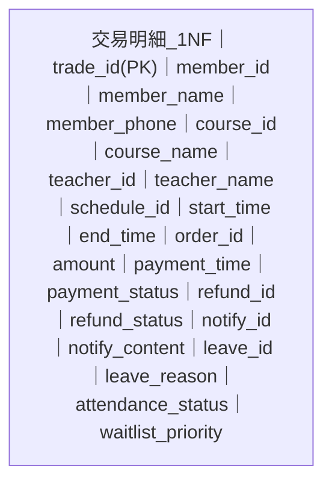
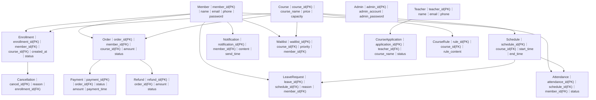

# 資料關聯表正規化（第一階與第二階）

以下圖檔依你提供的欄位內容，使用 Mermaid 長條圖表示：
- 第一階（1NF）
- 第二階（2NF）

---

## 第一階（1NF）

> 重點：欄位皆原子化、每列可唯一識別；但仍可能存在資料重複與傳遞相依。

---

## 第二階（2NF）

> 重點：將不同主題拆表，降低部分相依；但仍保留少量可能的傳遞相依（例如名稱類欄位重複存放）。

---

## 補充

- 這份是你要的「第一階 + 第二階」圖。
- 若你要，我可以下一版再補「第三階（3NF）」在同一份檔案，並在每張圖下方列出「不符合下一階的原因」方便交報告。

