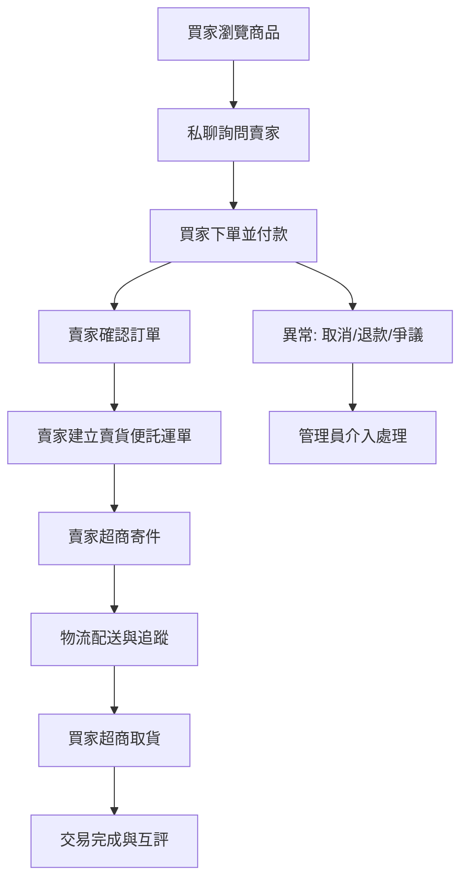
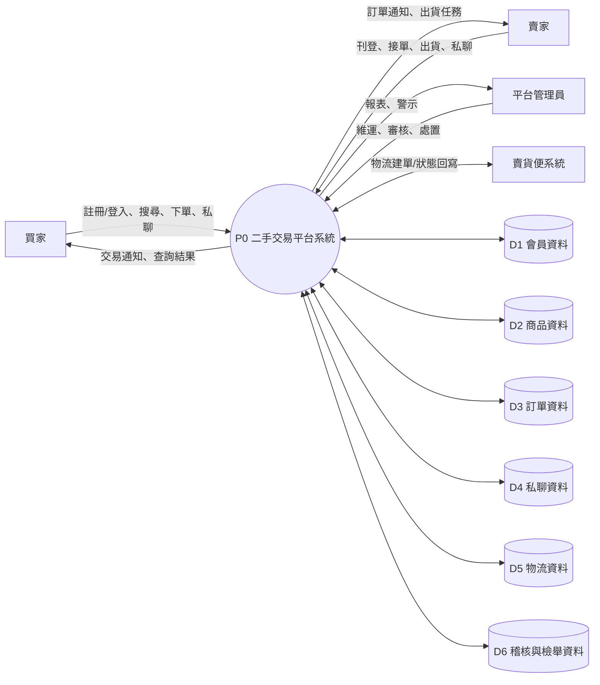
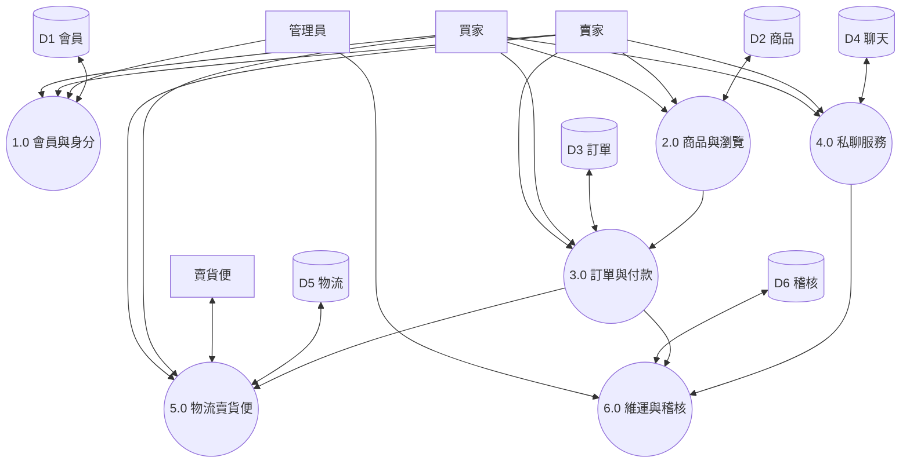
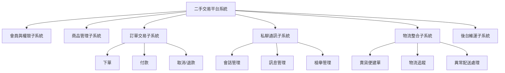
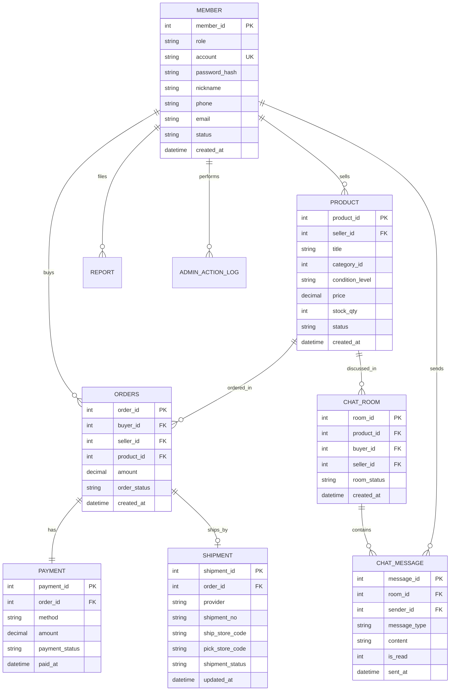

# C2C 二手買賣平台需求規格書（買家／賣家／平台管理員）

文件版本：v1.0  
適用對象：需求分析、系統分析、資料庫設計、前後端開發、測試

---

## 0. 專案概述

### 0.1 平台定位

本系統為 **C2C 二手買賣平台**，提供一般使用者之間（買家與賣家）刊登、搜尋、下單、付款、出貨、物流追蹤、評價與私聊溝通服務。  
物流採用超商 **賣貨便** 服務流程（店到店寄取件），平台管理員負責平台維運、稽核與異常處理。

### 0.2 系統目標

1. 建立可信賴的二手交易流程（商品刊登到完成收貨）。
2. 提供買賣雙方即時私聊，降低交易摩擦與資訊落差。
3. 透過賣貨便串接，標準化出貨與物流追蹤。
4. 提供管理員稽核工具，降低詐騙、違規與交易糾紛風險。

### 0.3 系統邊界與外部實體

- 外部實體 E1：買家
- 外部實體 E2：賣家
- 外部實體 E3：平台管理員
- 外部系統 E4：賣貨便物流系統
- 外部系統 E5：第三方金流（可選）
- 外部系統 E6：通知服務（Email/簡訊/推播）

---

## 1. 步驟一：平台概述與角色功能規格

> 本章對應：平台做什麼、各角色功能、流程圖、處理描述、藍圖、資料詞彙

## 1.1 角色與權限

### 1.1.1 買家（Buyer）

- 註冊／登入／帳號維護
- 瀏覽商品、搜尋與篩選
- 收藏商品、加入購物清單（可選）
- 與賣家私聊
- 建立訂單、付款、查看物流進度
- 完成收貨、評價、申請退貨／爭議

### 1.1.2 賣家（Seller）

- 註冊／登入／身分驗證（可選 KYC）
- 商品刊登、上下架、價格調整
- 接收訂單、確認備貨
- 建立賣貨便物流單、超商出貨
- 與買家私聊
- 查詢交易紀錄與收款資訊

### 1.1.3 平台管理員（Admin）

- 會員管理（停權、恢復、權限調整）
- 商品稽核（違規內容審核、下架）
- 訂單與爭議處理（調解、退款）
- 私聊稽核（依檢舉／法規）
- 平台維運（公告、參數設定、報表）

## 1.2 核心功能流程圖（整體）

## 1.3 功能處理描述（主要模組）

### 1.3.1 商品刊登（賣家）

- 作業名稱：商品刊登
- 前置條件：賣家已登入且帳號狀態正常
- 執行步驟：
  1. 賣家輸入商品名稱、分類、價格、描述、圖片、商品狀態。
  2. 系統驗證欄位完整性與價格範圍。
  3. 系統建立商品資料，狀態為「上架中」或「待審核」。
  4. 若需審核，管理員審核通過後對外顯示。
- 輸入：商品主資料、圖片檔
- 輸出：商品編號、上架結果
- 備註：可設定是否啟用自動下架條件（逾期未更新）。

### 1.3.2 私聊訊息（買家↔賣家）

- 作業名稱：私聊會話與訊息傳送
- 前置條件：雙方為已登入會員，且未遭停權
- 執行步驟：
  1. 買家從商品頁發起會話。
  2. 系統建立會話 room 並綁定商品與雙方身分。
  3. 雙方可傳送文字訊息（可擴充圖片）。
  4. 系統紀錄送達／已讀狀態。
  5. 若任一方檢舉，會話可進入稽核流程。
- 輸入：訊息內容、會話 ID
- 輸出：訊息紀錄、未讀數、通知事件
- 備註：訊息保存期限與調閱機制需符合個資法與平台政策。

### 1.3.3 下單付款（買家）

- 作業名稱：建立訂單與付款
- 前置條件：商品狀態可售、庫存（數量）足夠
- 執行步驟：
  1. 買家確認收件超商門市與付款方式。
  2. 系統建立訂單，狀態為「待付款」。
  3. 買家完成付款，系統更新為「已付款待出貨」。
  4. 系統通知賣家備貨出貨。
- 輸入：商品 ID、買家 ID、配送與付款資訊
- 輸出：訂單編號、付款結果
- 備註：付款成功後才視為交易成立。

### 1.3.4 賣貨便出貨（賣家）

- 作業名稱：賣貨便託運與出貨
- 前置條件：訂單狀態為「已付款待出貨」
- 執行步驟：
  1. 賣家於訂單頁點選「建立賣貨便託運單」。
  2. 系統向賣貨便建立物流單號。
  3. 賣家於期限內至超商寄件。
  4. 系統接收物流狀態回寫（寄件、轉運、到店、已取貨）。
- 輸入：訂單資料、寄件門市
- 輸出：物流單號、物流狀態軌跡
- 備註：逾期未寄件可自動觸發取消與退款流程。

### 1.3.5 平台維護（管理員）

- 作業名稱：平台維運與稽核
- 前置條件：管理員登入後台
- 執行步驟：
  1. 查詢異常交易、檢舉、違規商品與私聊檢舉案件。
  2. 依規則執行下架、停權、警示、退款調解等操作。
  3. 更新平台參數（手續費、公告、違規字詞規則）。
  4. 產出營運報表與風險監控紀錄。
- 輸入：後台操作指令
- 輸出：稽核紀錄、處理結果、通知
- 備註：所有管理操作需留存稽核軌跡。

## 1.4 功能藍圖（模組分解）

- A. 會員與權限模組
  - A1 註冊登入
  - A2 個人資料維護
  - A3 權限與狀態管理
- B. 商品交易模組
  - B1 商品刊登/上下架
  - B2 商品搜尋/篩選
  - B3 訂單建立/付款
- C. 私聊與通知模組
  - C1 會話建立
  - C2 訊息收發/已讀
  - C3 推播通知
- D. 物流模組（賣貨便）
  - D1 託運單建立
  - D2 物流狀態同步
  - D3 配送異常處理
- E. 管理後台模組
  - E1 商品稽核
  - E2 會員處置
  - E3 爭議與退款
  - E4 系統參數維護

## 1.5 資料詞彙（Data Dictionary）

### 1.5.1 會員 Member

- member_id：會員唯一識別碼（PK）
- role：角色（buyer / seller / admin）
- account：登入帳號（唯一）
- password_hash：密碼雜湊值
- nickname：顯示名稱
- phone：手機
- email：信箱
- status：正常/停權/刪除
- created_at：建立時間
- updated_at：更新時間

### 1.5.2 商品 Product

- product_id：商品識別碼（PK）
- seller_id：賣家會員 ID（FK -> Member）
- title：商品標題
- category_id：分類 ID
- condition_level：商品新舊狀態
- price：售價
- description：商品描述
- stock_qty：庫存（C2C 常為 1）
- status：上架/下架/已售出/違規下架
- created_at：建立時間

### 1.5.3 訂單 Order

- order_id：訂單識別碼（PK）
- buyer_id：買家會員 ID（FK）
- seller_id：賣家會員 ID（FK）
- product_id：商品 ID（FK）
- order_status：待付款/已付款待出貨/運送中/已完成/取消/退款
- amount：交易金額
- payment_status：未付款/已付款/退款
- shipping_status：未建立託運/已寄件/運送中/到店/已取貨
- created_at：建立時間

### 1.5.4 私聊會話 ChatRoom

- room_id：會話識別碼（PK）
- product_id：關聯商品 ID（FK）
- buyer_id：買家 ID（FK）
- seller_id：賣家 ID（FK）
- room_status：開啟/封存/稽核中
- created_at：建立時間

### 1.5.5 訊息 ChatMessage

- message_id：訊息識別碼（PK）
- room_id：會話 ID（FK）
- sender_id：發送者會員 ID（FK）
- message_type：text/image/system
- content：內容
- is_read：是否已讀
- sent_at：發送時間

### 1.5.6 物流 LogisticsShipment

- shipment_id：物流紀錄識別碼（PK）
- order_id：訂單 ID（FK）
- provider：物流商（固定賣貨便）
- shipment_no：物流單號
- ship_store_code：寄件門市代碼
- pick_store_code：取件門市代碼
- shipment_status：建立託運/已寄件/配送中/到店/已取貨/退回
- updated_at：狀態更新時間

---

## 2. 步驟二：系統分析文件（DFD、處理規格、結構圖、HIPO）

## 2.1 DFD（0 階）

## 2.2 DFD（1 階）

## 2.3 處理規格描述（Process Specification）

### P1 會員與身分

- 輸入：註冊資料、登入憑證、管理員維護指令
- 處理：帳密驗證、角色授權、狀態檢查、權限控制
- 輸出：Session/Token、會員狀態、登入結果
- 異常：帳號停權、密碼錯誤、權限不足

### P2 商品與瀏覽

- 輸入：商品主檔、搜尋條件、上下架指令
- 處理：商品資料驗證、索引查詢、可見性判斷
- 輸出：商品清單、商品詳細、刊登結果
- 異常：違規商品、欄位缺漏、無資料

### P3 訂單與付款

- 輸入：下單資料、付款結果、取消指令
- 處理：建立訂單、狀態轉移、金額校驗、退款流程
- 輸出：訂單編號、付款狀態、交易結果
- 異常：重複下單、付款失敗、逾時取消

### P4 私聊服務

- 輸入：會話建立請求、訊息內容、檢舉事件
- 處理：建立 room、訊息儲存、已讀更新、通知推送
- 輸出：訊息串、未讀數、檢舉案件
- 異常：禁言/停權、內容違規、傳送失敗

### P5 物流賣貨便

- 輸入：出貨請求、門市資訊、物流回寫事件
- 處理：建立託運、物流狀態同步、簽收判定
- 輸出：物流單號、追蹤狀態、收貨結果
- 異常：未寄件逾時、退回件、配送異常

### P6 維運與稽核

- 輸入：檢舉資料、後台操作、風險事件
- 處理：審核、處置、紀錄、通知、報表彙整
- 輸出：審核結果、停權/下架結果、營運報表
- 異常：高風險帳號、爭議升級、法規要求調閱

## 2.4 結構圖（Structure Chart）

## 2.5 HIPO

### 2.5.1 Hierarchy（階層）

- H0 二手交易平台
  - H1 會員與身分
  - H2 商品與刊登
  - H3 訂單與付款
  - H4 私聊服務
  - H5 物流賣貨便
  - H6 後台維運

### 2.5.2 IPO（Input / Process / Output）

- 模組 H3 訂單與付款
  - Input：買家下單資訊、商品資訊、付款回傳
  - Process：建立訂單、扣庫存（或鎖定）、更新狀態、觸發通知
  - Output：訂單成立結果、付款結果、後續出貨任務

- 模組 H4 私聊服務
  - Input：發訊者、會話 ID、訊息內容
  - Process：訊息驗證、儲存、推播、已讀處理
  - Output：聊天訊息流、通知、檢舉紀錄

- 模組 H5 物流賣貨便
  - Input：訂單與門市資料、物流回寫事件
  - Process：建單、狀態同步、配送異常判定
  - Output：物流單號、追蹤紀錄、完成簽收結果

---

## 3. 步驟三：DFD 轉 ERD、關聯表、正規化到 3NF

## 3.1 DFD 轉 ERD（實體關係定義）

### 3.1.1 實體清單

- Member（會員）
- Product（商品）
- ProductImage（商品圖片）
- Order（訂單）
- Payment（付款）
- Shipment（物流）
- ChatRoom（私聊會話）
- ChatMessage（私聊訊息）
- Report（檢舉）
- AdminActionLog（管理操作紀錄）

### 3.1.2 關係說明

- Member(賣家) 1 --- N Product
- Member(買家) 1 --- N Order
- Product 1 --- N Order（一般 C2C 實務可限制有效成交 1 筆）
- Order 1 --- 1 Payment（可擴充為 1:N 付款嘗試）
- Order 1 --- 0..1 Shipment
- Product 1 --- N ChatRoom（同商品可有多買家詢問）
- ChatRoom 1 --- N ChatMessage
- Member 1 --- N ChatMessage（sender）
- Member 1 --- N Report
- Admin 1 --- N AdminActionLog

## 3.2 ERD（Mermaid）

## 3.3 由 ERD 轉資料關聯表（Relational Schema）

### 3.3.1 關聯表定義

- MEMBER(
  member_id PK,
  role,
  account UK,
  password_hash,
  nickname,
  phone UK,
  email UK,
  status,
  created_at,
  updated_at
  )

- PRODUCT(
  product_id PK,
  seller_id FK -> MEMBER.member_id,
  title,
  category_id,
  condition_level,
  price,
  description,
  stock_qty,
  status,
  created_at,
  updated_at
  )

- PRODUCT_IMAGE(
  image_id PK,
  product_id FK -> PRODUCT.product_id,
  image_url,
  sort_no
  )

- ORDERS(
  order_id PK,
  buyer_id FK -> MEMBER.member_id,
  seller_id FK -> MEMBER.member_id,
  product_id FK -> PRODUCT.product_id,
  amount,
  order_status,
  payment_status,
  shipping_status,
  created_at,
  updated_at
  )

- PAYMENT(
  payment_id PK,
  order_id FK -> ORDERS.order_id,
  method,
  amount,
  payment_status,
  transaction_no UK,
  paid_at
  )

- SHIPMENT(
  shipment_id PK,
  order_id FK -> ORDERS.order_id,
  provider,
  shipment_no UK,
  ship_store_code,
  pick_store_code,
  shipment_status,
  updated_at
  )

- CHAT_ROOM(
  room_id PK,
  product_id FK -> PRODUCT.product_id,
  buyer_id FK -> MEMBER.member_id,
  seller_id FK -> MEMBER.member_id,
  room_status,
  created_at
  )

- CHAT_MESSAGE(
  message_id PK,
  room_id FK -> CHAT_ROOM.room_id,
  sender_id FK -> MEMBER.member_id,
  message_type,
  content,
  is_read,
  sent_at
  )

- REPORT(
  report_id PK,
  reporter_id FK -> MEMBER.member_id,
  target_member_id FK -> MEMBER.member_id,
  order_id FK -> ORDERS.order_id,
  room_id FK -> CHAT_ROOM.room_id,
  reason_code,
  reason_detail,
  report_status,
  created_at
  )

- ADMIN_ACTION_LOG(
  log_id PK,
  admin_id FK -> MEMBER.member_id,
  target_type,
  target_id,
  action_type,
  action_note,
  created_at
  )

## 3.4 正規化至第三正規化（3NF）

### 3.4.1 正規化前（UNF）問題示意

若初始使用單一交易大表 `TRADE_ALL_IN_ONE`，可能包含：

- 訂單欄位 + 會員欄位 + 商品欄位 + 物流欄位 + 聊天最後訊息欄位
- 問題：重複資料高、更新異常、刪除異常、插入異常

### 3.4.2 第一正規化（1NF）

- 將重複群組拆分為原子欄位
- 例如商品多圖拆成 `PRODUCT_IMAGE`
- 一筆資料只代表一個實體關係

### 3.4.3 第二正規化（2NF）

- 消除對組合鍵的部分相依
- 訂單主鍵為 `order_id` 後，商品屬性（title/price）移出至 `PRODUCT`
- 會員屬性（nickname/phone）移出至 `MEMBER`

### 3.4.4 第三正規化（3NF）

- 消除傳遞相依
- 例 1：`ORDERS` 不直接存 `buyer_phone`，改由 `buyer_id -> MEMBER.phone`
- 例 2：`SHIPMENT` 不重複保存訂單金額，改由 `order_id -> ORDERS.amount`
- 例 3：`CHAT_MESSAGE` 不保存商品標題，透過 `room_id -> CHAT_ROOM.product_id -> PRODUCT.title`

### 3.4.5 3NF 完成後效益

- 減少資料冗餘與不一致
- 交易、聊天、物流、會員可獨立維護
- 有利於後續擴充（議價、優惠券、多物流商）

---

## 4. 補充：關鍵業務規則（建議納入需求驗收）

1. 同一商品在「已付款」後不得再被其他買家成功下單。
2. 賣家未於規定時間寄件，系統自動取消訂單並發起退款。
3. 私聊僅允許交易雙方進入該商品會話。
4. 管理員所有操作需留存不可竄改稽核紀錄。
5. 退款流程需能關聯原訂單、物流狀態與爭議原因。

## 5. 驗收重點（對應角色）

- 買家驗收：找得到商品、聊得到賣家、付得了款、查得到物流、能完成評價。
- 賣家驗收：刊登流程順、接單出貨清楚、賣貨便串接成功、能追蹤交易狀態。
- 管理員驗收：能維護會員與商品、可處理檢舉退款、具備完整後台報表與稽核軌跡。

---

## 6. 文件結論

本規格書已依需求完成：

- 步驟一：平台概述、角色功能、流程圖、處理描述、藍圖、資料詞彙
- 步驟二：DFD（0/1 階）、處理規格、結構圖、HIPO
- 步驟三：DFD 轉 ERD、ERD 轉資料關聯表、正規化至 3NF

可直接作為後續：

- 系統分析報告
- 資料庫建模
- API 規格撰寫
- 測試案例與驗收基準制定
